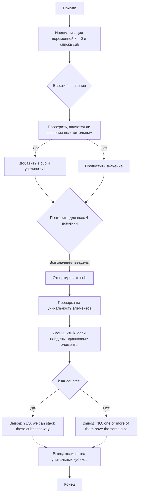

## Отчет по лабораторной работе № 1

#### № группы: `ПМ-2401`

#### Выполнил: `Гречков Максим Дмитриевич`

#### Вариант: `9`

### Cодержание:

- [Постановка задачи](#1-постановка-задачи)
- [Входные и выходные данные](#2-входные-и-выходные-данные)
- [Выбор структуры данных](#3-выбор-структуры-данных)
- [Алгоритм](#4-алгоритм)
- [Программа](#5-программа)
- [Анализ правильности решения](#6-анализ-правильности-решения)

### 1. Постановка задачи

> Программа получает на вход 4 числа A, B, C и D не пресыщающих по модулю 10<sup>9</sup>. Нужно выяснить, из скольки чисел
> составить строго возрастающюю последовательность. Если это все числа, то вывести "для всех чисел"
Данную задачу можно разделить на 2 подзадачи: сортировка и сравнение попарно чисел.

- Для 1 подзадачи нужно:
    1. `Запихнуть данные в ArrayList и отсортировать`
- Для 2 подзадачи нужно:
    1. `В цикле сравнить i и i-1 числа. Если они повторяются то изменяем счетчик`
    2. `Если счетчик не равен количеству valid numbers, то есть повторяющиеся элементы, если равен то таких нет`


### 2. Входные и выходные данные

#### Данные на вход

На вход программа должна получать 4 числа, при этом в условии сказано, что они натуральные, а значит будем использовать `Integer`. Граница таких чисел <= 10<sup>9</sup>

|             | Тип                | min значение    | max значение   |
|-------------|--------------------|-----------------|----------------|
| A (Число 1) | Натуральное  число | -10<sup>9</sup> | 10<sup>9</sup> |
| B (Число 2) | Натуральное  число | -10<sup>9</sup> | 10<sup>9</sup> |
| C (Число 3) | Натуральное  число | -10<sup>9</sup> | 10<sup>9</sup> |
| D (Число 4) | Натуральное  число | -10<sup>9</sup> | 10<sup>9</sup> |

#### Данные на выход

Программа должна вывести количество кубиков, которые можно поставить друг на друга и все ли кубы попали под условие.
Значит выходными данными будет строка с сообщением и натуральное число

|         | Тип               | min значение | max значение   |
|---------|-------------------|--------------|----------------|
| Число 1 | Натуральное число | 0            | 10<sup>9</sup> |
| Строка 1| Строка            |       -      |       -        |

### 3. Выбор структуры данных

Программа получает 4 натуральных числа, поэтому будем работать с типом данных `Integer`. Для их хранения сделаем
массив, в который будем складывать числа подходящие под задачу (>0)

|                 | название переменной | Тип (в Java)         | 
|---------------|--------------------------|----------------------|
| cub(массив) | `cub`                       | `ArrayList<Integer>`|

Для вывода результата необязательно его хранить в отдельной переменной.

### 4. Алгоритм

#### Алгоритм выполнения программы:

1. **Ввод данных:**  
   Программа заполняет лист данными с клавиатуры, отбрасывая ненужные.

2. **Сравнение чисел:**  
   Программа сравнивает соседние элементы. Если они равны, то увеличивается счетчик.

3. **Вывод результата:**  
   На экран выводится количество кубиков в башне и сообщение, задействованы ли все кубики.

#### Блок-схема



### 5. Программа

```java
package com.company;

import java.io.PrintStream;
import java.util.ArrayList;
import java.util.Collections;
import java.util.Objects;
import java.util.Scanner;

public class Main {
    // Объявляем объект класса Scanner для ввода данных
    public static Scanner in = new Scanner(System.in);
    // Объявляем объект класса PrintStream для вывода данных
    public static PrintStream out = System.out;

    public static void main(String[] args) {
        int k = 0;
        //Создаем лист с нашими переменными
        var cub = new ArrayList<Integer>();
        //заполняем его
        for (int i = 0; i < 4; i++) {
            int z = in.nextInt();
            if (z > 0){ //проверка на неликвидное значение размера
                cub.add(z);
                k++;
            }
        }
        int counter = k; //сколько в итоге реальных кубиков нам дали
        Collections.sort(cub);
        //сравнение кубов
        for (int i = 1; i < counter; i++) {
            if (Objects.equals(cub.get(i), cub.get(i - 1))) {
                k--;
            }
        }
        //Вывод
        if (k == counter)
            out.println("YES, we can stack these cubs that way");
        else out.println("NO, one or more of them have the same size");
        out.println(k + " of them we can stack");
    }
}
```

### 6. Анализ правильности решения

Программа работает корректно на всем множестве решений с учетом ограничений.

1. Тест на `разные`:

    - **Input**:
        ```
        1 2 3 4
        ```

    - **Output**:
        ```
        YES, we can stack these cubs that way
        4 of them we can stack
        ```

2. Тест на `0` :

    - **Input**:
        ```
        0 0 0 1
        ```

    - **Output**:
        ```
        NO, one or more of them have the same size
        1 of them we can stack
        ```

3. Тест на ограничение задачи:

    - **Input**:
        ```
        10000000 1000 1000 10
        ```

    - **Output**:
        ```
        NO, one or more of them have the same size
        3 of them we can stack
        ```
